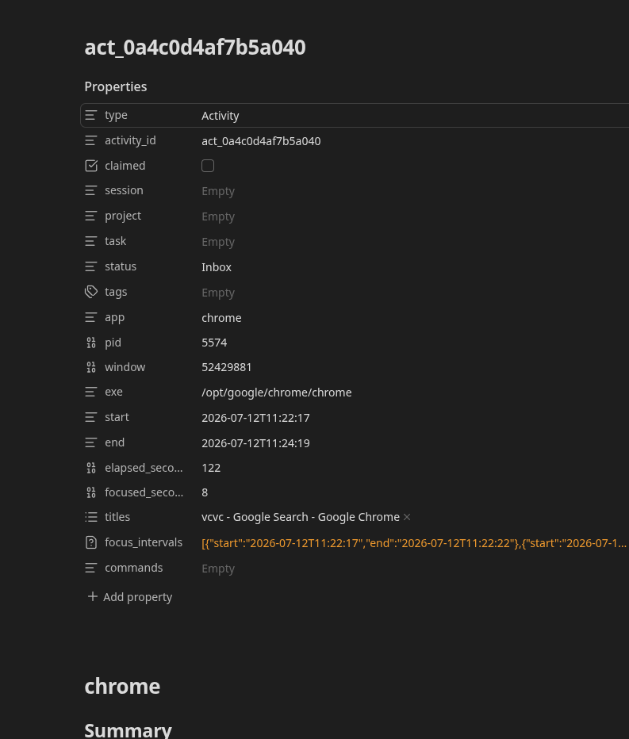
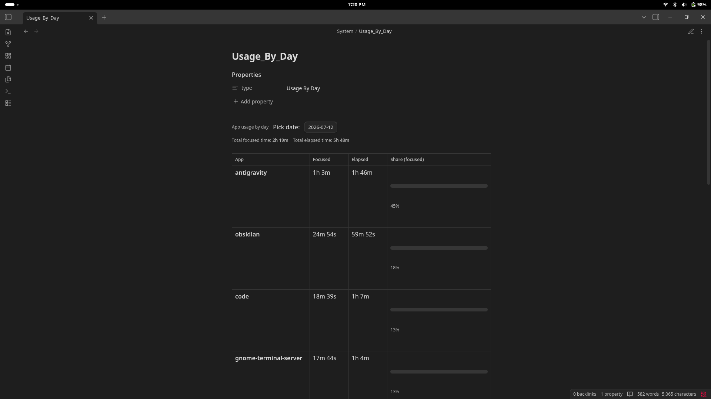
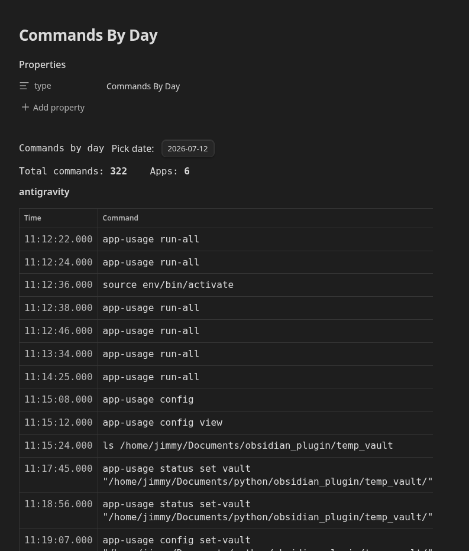
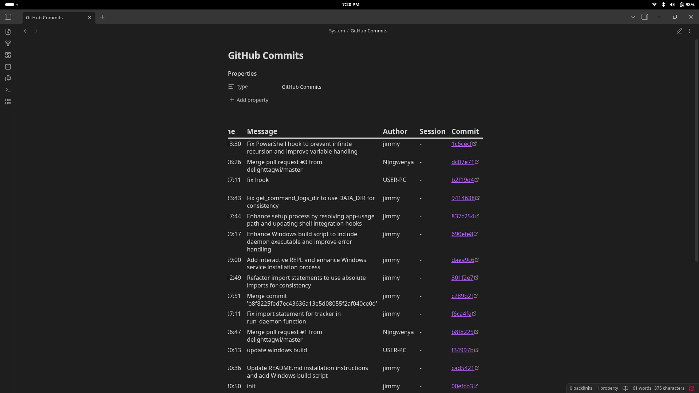
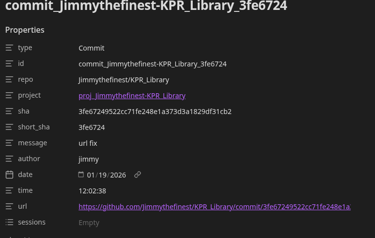

# app-usage

**app-usage** is a cross-platform desktop activity tracker that integrates directly with **Obsidian**.

Instead of only displaying graphs or statistics, app-usage converts your desktop activity into structured Markdown notes that become part of your Obsidian vault. Every application session can be imported as a note with Dataview-compatible metadata, allowing you to search, organise, and link your computer activity alongside your existing notes.

The project is designed to work completely offline. All activity is stored locally on your computer, and no account or cloud service is required. GitHub synchronization is available as an optional feature for users who want to import repository activity into their vault.

---
## Table of Contents

- [Features](#features)
- [Screenshots](#screenshots)
- [Vault Structure](#vault-structure)
- [How It Works](#how-it-works)
- [Installation](#installation)
  - [Windows](#windows)
  - [Linux (Standalone Binary)](#linux-standalone-binary)
  - [Linux (Python)](#linux-python)
- [First-Time Setup](#first-time-setup)
- [Quick Start](#quick-start)
- [Command Reference](#command-reference)
  - [`daemon`](#daemon)
  - [`build`](#build)
  - [`sync`](#sync)
  - [`import`](#import)
  - [`run-all`](#run-all)
  - [`config`](#config)
- [Generated Notes](#generated-notes)
  - [Activity Notes](#activity-notes)
  - [Session Notes](#session-notes)
  - [Commit Notes](#commit-notes)
  - [Project Notes](#project-notes)
- [Data Directories](#data-directories)
- [Supported Platforms](#supported-platforms)
- [FAQ](#frequently-asked-questions)
- [Contributing](#contributing)
- [Developer Guide](#developer-guide)
- [License](#license)

## Screenshots

<details open>
<summary><strong>Activities Dashboard</strong></summary>



Shows imported activity sessions.

</details>

<details>
<summary><strong>Usage by Day</strong></summary>



Shows daily application usage.

</details>

<details>
<summary><strong>Commands by Day</strong></summary>



Displays recorded shell commands.

</details>

<details>
<summary><strong>Repository Overview</strong></summary>



</details>

<details>
<summary><strong>Generated Commit Note</strong></summary>



</details>

## What Does app-usage Do?

app-usage continuously records desktop activity while it runs in the background. It records events such as:

* The application currently in focus.
* Window title changes.
* Idle periods.
* Screen lock and unlock events.
* Optional shell command history.
* Optional GitHub repository activity.

These events are processed into activity sessions and imported into your Obsidian vault as Markdown notes. Because the notes contain standard YAML frontmatter, they can be queried using plugins such as **Dataview** without requiring any additional software.

The generated notes are intended to be linked together with the rest of your knowledge base. For example, an Obsidian session can link together:

* Activities performed during a study session.
* Commands executed while working on a project.
* Git commits created during that session.
* Project notes related to the work.

Rather than existing as isolated statistics, desktop activity becomes searchable documentation inside your vault.

---

## Features

### Desktop Activity Tracking

Records application usage across supported platforms, including:

* Active application
* Window title history
* Time spent focused
* Idle detection
* Screen lock and unlock events

Each application session becomes a structured activity that can later be imported into Obsidian.

---

### Obsidian Integration

app-usage is designed specifically for Obsidian workflows.

Generated notes use standard Markdown with YAML frontmatter and are compatible with community plugins such as Dataview.

Imported notes can be:

* Linked to existing notes
* Tagged
* Organised into folders
* Queried with Dataview
* Included in dashboards

Manual edits are preserved when notes are regenerated, allowing imported notes to become part of your personal knowledge base rather than disposable generated files.

---

### Session-Based Workflow

Activities can be grouped into higher-level Session notes.

For example, a three-hour programming session might contain:

* Multiple Visual Studio Code activities
* Browser research
* Obsidian note-taking
* Terminal sessions
* Git commits
* Shell commands

Instead of viewing each application separately, the entire work session can be linked together inside Obsidian.

---

### Optional Shell Command Logging

For terminal users, app-usage can optionally record shell commands executed during an activity.

These commands are associated with the application session in which they were run, making it possible to see not only how long an application was used, but also what work was performed during that time.

Shell command logging is optional and can be enabled during setup.

---

### GitHub Integration

GitHub synchronization is optional.

Configured repositories can be synchronized using the GitHub CLI (`gh`), generating Markdown notes for:

* Commits
* Repository summaries
* Project information

These notes are imported into your vault alongside activity notes, making it possible to connect development work with recorded desktop activity.

---

### Offline First

All desktop activity is stored locally.

The application does not require:

* An online account
* Cloud synchronization
* Remote storage
* External analytics services

The only network communication performed by app-usage is optional GitHub synchronization for repositories that you explicitly configure.

---

## Vault Structure

After importing activities, your vault will contain machine-generated notes organised into dedicated folders.
I added a Example vault check it out and maybe configure with it first to play arround
```text
Your Vault/
├── Activities/
├── Sessions/
├── commits/
└── projects/
```

### Activities

The `Activities` folder contains one note for each recorded application activity.

These notes include information such as:

* Application name
* Start and end time
* Focus duration
* Window titles
* Commands executed during the activity
* Optional link to a Session note

Activities are intended to represent the smallest unit of recorded work.

---

### Sessions

Sessions are higher-level notes that organise multiple Activities into a single work period.

For example:

* Study Session
* Programming Session
* University Assignment
* Research Session

Instead of manually recording what happened during a work session, Activities can be linked together under a single Session note.

---

### commits

The `commits` folder contains Markdown notes generated from GitHub repositories configured through the application.

These notes make it possible to browse commit history directly inside Obsidian and relate commits to activity sessions or project notes.

---

### projects

The `projects` folder contains one note for each configured GitHub repository.

Project notes can be used as central dashboards that link together:

* Commit history
* Activity notes
* Session notes
* Existing project documentation

---

## How It Works

app-usage separates activity collection from note generation.

The background daemon records desktop events throughout the day. These events are stored as raw analytics logs and later processed into structured activity sessions before being imported into your Obsidian vault.

```text
Desktop Activity
       │
       ▼
Background Tracker
       │
       ▼
analytics/*.jsonl
       │
       ▼
build
       │
       ▼
activities/*.json
       │
       ├── import
       │       │
       │       ▼
       │   Obsidian Notes
       │
       └── sync
               │
               ▼
      GitHub Repository Notes
```

This separation provides several advantages:

* Raw analytics remain available for future processing.
* Activities can be rebuilt if processing rules change.
* Notes can be regenerated without losing manual edits.
* GitHub synchronization remains independent of activity tracking.

---

## Privacy

app-usage stores activity locally on your computer.

It does **not**:

* Upload desktop activity to external servers.
* Require an online account.
* Send telemetry.
* Monitor keyboard input.

GitHub communication is optional and is only performed when the `sync` command is used with repositories that you have explicitly configured.

---

The following sections cover installation on Windows and Linux, first-time setup, and the available command-line interface.
## Installation

app-usage is available as a standalone application for Windows and Linux. Python installation is also available for users who wish to run the project from source.

---

# Windows

The Windows release is intended for users who simply want to install and use the application.

### 1. Download the Latest Release

Download the latest Windows release (`.zip`) from the project's **Releases** page.

---

### 2. Extract the Archive

Extract the archive to a permanent location on your computer.

For example:

```text
C:\app-usage\
```

or

```text
C:\Program Files\app-usage\
```

Avoid placing the application inside temporary folders such as Downloads, as the tracker and its configuration are intended to remain installed.

---

### 3. Keep the Executables Together

The Windows release contains two executables:

* `app-usage.exe`
* the background tracker executable

Both files should remain in the same directory after extraction.

---

### 4. Run the Setup Wizard

Open a terminal inside the installation folder and run:

```bash
app-usage.exe setup
```

Alternatively, you can simply double-click **app-usage.exe** and select **setup** when prompted.

The setup wizard will guide you through the installation process.

During setup you will be asked to:

* Select your Obsidian vault.
* Enable or disable shell command logging.
* Configure the background tracker to start automatically when you log in.

Once setup is complete, app-usage is ready to use.

---

### 5. Start Tracking

If automatic startup was enabled during setup, the tracker will begin recording activity the next time you sign in.

To start tracking immediately, run:

```bash
app-usage.exe daemon
```

The daemon runs quietly in the background while recording desktop activity.

---

# Linux (Standalone Binary)

A standalone Linux binary is available for users who do not wish to install Python.

### 1. Download the Binary

Download the latest Linux release from the project's Releases page.

---

### 2. Move the Binary

Move the executable to a permanent location.

For example:

```bash
mkdir -p ~/.local/bin
mv app-usage ~/.local/bin/
```

If you prefer a system-wide installation:

```bash
sudo mv app-usage /usr/local/bin/
```

---

### 3. Make It Executable

```bash
chmod +x ~/.local/bin/app-usage
```

or

```bash
chmod +x /usr/local/bin/app-usage
```

---

### 4. Run the Setup Wizard

```bash
app-usage setup
```

The setup wizard will:

* Ask for your Obsidian vault.
* Configure shell command logging (optional).
* Install the background service.
* Configure automatic startup.

---

### 5. Start Tracking

To begin recording activity immediately:

```bash
app-usage daemon
```

If automatic startup was enabled, this step is only required the first time.

---

# Linux (Python)

Running from source requires:

* Python 3.10 or newer
* pip

A virtual environment is recommended.

Clone the repository:

```bash
git clone <repository-url>
cd app-usage
```

Create a virtual environment:

```bash
python -m venv .venv
```

Activate it:

```bash
source .venv/bin/activate
```

Install the project:

```bash
pip install .
```

After installation the command becomes available as:

```bash
app-usage
```

Run the setup wizard:

```bash
app-usage setup
```

---

# First-Time Setup

The setup wizard performs the initial configuration required by app-usage.

```bash
app-usage setup
```

During setup you will be asked to provide:

## Obsidian Vault

Select the root directory of the Obsidian vault where generated notes should be imported.

This location can be changed later using the configuration commands.

---

## Shell Command Logging (Optional)

If enabled, app-usage can associate shell commands with the activity in which they were executed.

This feature is optional and may be disabled during setup or later through the configuration file.

---

## Automatic Startup

The setup wizard can configure app-usage to start automatically whenever you log into your computer.

This allows activity to be recorded without manually starting the daemon each time.

---

## Configuration

After setup, configuration is stored in the application's configuration directory.

Typical configuration includes:

* Obsidian vault location
* Configured GitHub repositories
* Shell logging settings
* Platform-specific options

Configuration can be viewed or modified at any time using the `config` command.

---

# Quick Start

After completing setup, a typical workflow looks like this.

Start the background tracker:

```bash
app-usage daemon
```

When you are ready to generate notes, run:

```bash
app-usage run-all
```

This command performs the complete processing pipeline:

```text
build
   │
   ▼
sync
   │
   ▼
import
```

At the end of the process your Obsidian vault will contain:

```text
Activities/
Sessions/
commits/
projects/
```

Any manual changes you have made to imported notes are preserved during future imports.

---

# Updating

When a new release becomes available:

### Windows

1. Download the latest release.
2. Replace the existing executables.
3. Run:

```bash
app-usage setup
```

if new configuration options have been introduced.

Existing analytics data and configuration are preserved.

---

### Linux Binary

Replace the existing executable with the new release.

No additional steps are normally required.

---

### Python Installation

Pull the latest changes and reinstall the package.

```bash
git pull
pip install .
```

---

The next section documents each command in detail, including the files it reads, the files it generates, and how each stage of the processing pipeline works.
# Command Reference

app-usage is organised as a series of small commands. Each command performs a single stage of the processing pipeline, allowing you to run only the steps you need or execute the entire workflow with a single command.

```text
Desktop Activity
       │
       ▼
daemon
       │
       ▼
analytics/*.jsonl
       │
       ▼
build
       │
       ▼
activities/*.json
       │
       ├── import
       │       │
       │       ▼
       │   Obsidian Notes
       │
       └── sync
               │
               ▼
      GitHub Repository Notes
```

Most users will only need two commands:

```bash
app-usage daemon
```

Runs continuously in the background and records activity.

```bash
app-usage run-all
```

Processes the recorded data and updates your Obsidian vault.

---

# daemon

```bash
app-usage daemon
```

Starts the background tracker responsible for recording desktop activity.

The daemon runs continuously until stopped and writes events to daily analytics log files. It is designed to use very little system resources and can be configured to start automatically when you log in.

## Recorded Events

Depending on the operating system and desktop environment, the daemon records:

* Active application changes
* Window title changes
* Focus changes
* Idle periods
* User activity after idle
* Screen lock events
* Screen unlock events

When shell command logging is enabled, shell commands are recorded separately and later associated with the appropriate activity during the build stage.

## Output

The daemon writes raw analytics files to:

### Linux

```text
~/.local/share/app_usage/analytics/
```

### Windows

```text
%LOCALAPPDATA%\app_usage\analytics\
```

A new `.jsonl` file is created for each day.

Each line in the file represents a single recorded event.

The analytics files are intended for machine processing and should not normally require manual editing.

---

# build

```bash
app-usage build
```

Processes raw analytics logs into structured activity sessions.

Rather than importing thousands of individual events into Obsidian, the build stage groups related events together into meaningful activities.

For example:

```text
Visual Studio Code
09:00 → 10:15

↓

Single Activity
```

Window title changes, focus intervals, idle periods and shell commands are combined into one activity record.

## Input

Reads:

```text
analytics/*.jsonl
```

and, if enabled,

```text
~/.command_logs/*.jsonl
```

## Output

Writes processed activities to:

### Linux

```text
~/.local/share/app_usage/activities/
```

### Windows

```text
%LOCALAPPDATA%\app_usage\activities\
```

Each JSON file contains one processed activity ready for import into Obsidian.

The build command may be run multiple times.

If processing rules change in future versions, activities can simply be rebuilt from the original analytics files without losing the raw event history.

---

# sync

```bash
app-usage sync
```

Synchronises configured GitHub repositories.

GitHub integration is completely optional.

If no repositories have been configured, this command performs no action.

## Requirements

GitHub synchronisation requires:

* GitHub CLI (`gh`)
* An authenticated GitHub account

Repositories can be configured using:

```bash
app-usage config add-repo owner/repository
```

## Imported Data

Depending on the configured integrations, sync may retrieve:

* Commits
* Repository metadata
* Issues
* Other repository information

The downloaded information is converted into Markdown notes that are imported into your Obsidian vault.

This allows repository activity to be linked with Activities and Sessions.

---

# import

```bash
app-usage import
```

Imports processed activities into your Obsidian vault.

This command converts processed activity JSON files into Markdown notes with YAML frontmatter suitable for Dataview.

## Input

Reads:

```text
activities/*.json
```

## Output

Creates notes inside your configured vault.

Typical folders include:

```text
Activities/
Sessions/
commits/
projects/
```

Generated notes are standard Markdown files and may be opened and edited like any other note in Obsidian.

## Preserving Manual Changes

One of the design goals of app-usage is allowing generated notes to become part of your knowledge base.

If you add:

* Tags
* Internal links
* Session references
* Additional notes
* Dataview fields

those edits are preserved during future imports.

This allows imported notes to evolve over time instead of being overwritten every time the importer runs.

---

# run-all

```bash
app-usage run-all
```

Runs the complete processing pipeline.

This command is equivalent to executing:

```text
build
↓
sync
↓
import
```

It is intended for day-to-day use and is the simplest way to update your vault after desktop activity has been recorded.

Typical workflow:

```bash
app-usage daemon
```

Work normally throughout the day.

Then run:

```bash
app-usage run-all
```

Your vault will be updated with:

* New Activities
* Updated Sessions
* New GitHub commits
* Updated project notes

---

# config

```bash
app-usage config
```

Manages application configuration.

Configuration is stored in:

### Linux

```text
~/.config/app_usage/config.json
```

### Windows

```text
%LOCALAPPDATA%\app_usage\config.json
```

---

## View Configuration

```bash
app-usage config view
```

Displays the current configuration.

Typical information includes:

* Vault location
* Configured repositories
* Optional settings

---

## Set the Vault

```bash
app-usage config set-vault /path/to/vault
```

Updates the Obsidian vault used by the importer.

Future imports will write notes into the newly configured vault.

---

## Add a Repository

```bash
app-usage config add-repo owner/repository
```

Registers a GitHub repository for synchronisation.

The next time `sync` or `run-all` is executed, repository information will be imported into your vault.

Multiple repositories may be configured.

---

## Remove a Repository

```bash
app-usage config remove-repo owner/repository
```

Removes a repository from the synchronization list.

Existing Markdown notes remain in your vault unless manually deleted.

---

# Typical Workflow

For most users, app-usage follows a simple daily workflow.

## 1. Start the tracker

```bash
app-usage daemon
```

The daemon records desktop activity while you work.

---

## 2. Continue Using Your Computer

Use your computer normally.

The daemon records application usage, idle periods, window titles and other supported events in the background.

---

## 3. Update Your Vault

When you are ready to import the day's activity:

```bash
app-usage run-all
```

The recorded data is processed and converted into Markdown notes inside your Obsidian vault.

---

# Command Summary

| Command   | Description                                         |
| --------- | --------------------------------------------------- |
| `daemon`  | Records desktop activity in the background.         |
| `build`   | Processes raw analytics into structured activities. |
| `sync`    | Synchronises configured GitHub repositories.        |
| `import`  | Imports processed activities into Obsidian.         |
| `run-all` | Executes `build`, `sync`, and `import`.             |
| `config`  | Manages application configuration.                  |

The following section describes the generated notes, data directories, supported platforms, and answers common questions about how app-usage stores and imports activity.
# Generated Notes

One of the primary goals of app-usage is to generate notes that integrate naturally with an existing Obsidian vault.

Unlike traditional activity trackers that only produce statistics or charts, app-usage generates standard Markdown files with YAML frontmatter. These notes can be edited, linked, tagged, queried with Dataview, and incorporated into your existing workflow.

---

# Activity Notes

Each recorded application session is imported as an individual Activity note.

An Activity typically contains information such as:

* Application name
* Start and end time
* Total focused time
* Window titles observed during the session
* Shell commands (optional)
* A link to a Session note

Example:

```yaml
---
type: activity

application: Obsidian
process: obsidian

start: 2026-07-12T09:14:32
end: 2026-07-12T10:48:11

duration: 01:33:39
focused: 01:28:14

session:

titles:
  - README.md - Obsidian
  - Daily Notes - Obsidian
  - Project.md - Obsidian

commands:
  - git status
  - python main.py
  - npm test

tags:
  - activity
---
```

Because Activity notes are ordinary Markdown files, you are free to add your own content beneath the generated metadata.

For example:

* observations
* progress updates
* links to documentation
* screenshots
* additional tags

---

# Session Notes

Activities are intended to be grouped together into higher-level Session notes.

Rather than representing a single application, a Session represents an entire period of work.

For example:

```text
Programming Session
│
├── Visual Studio Code
├── Obsidian
├── Firefox
├── Terminal
└── Git Commits
```

A Session note allows related Activities to be organised together regardless of which applications were used.

Possible Sessions include:

* Programming
* Studying
* Research
* Writing
* University Assignments
* Personal Projects

Because Sessions are standard Obsidian notes, you can organise them however you prefer.

---

# Commit Notes

If GitHub synchronization is enabled, app-usage generates Markdown notes for commits made to configured repositories.

These notes are intended to become part of your vault rather than replacing GitHub.

Typical information includes:

* Commit message
* Repository
* Commit hash
* Author
* Date
* Links to related project notes

Commit notes can also be linked to Session notes to provide context about when work was completed.

---

# Project Notes

Each configured repository generates a project note.

Project notes act as dashboards for repository activity.

They can contain:

* Repository metadata
* Commit history
* Dataview queries
* Links to documentation
* Related Session notes
* Related Activity notes

Because project notes are ordinary Markdown files, additional documentation can be written directly alongside imported repository information.

---

# Editing Imported Notes

Generated notes are intended to become part of your knowledge base.

You are encouraged to edit them.

Typical additions include:

* Tags
* Internal links
* Callouts
* Embedded images
* Comments
* Dataview fields
* Tasks

Unlike many generated files, imported notes are not treated as disposable output.

---

# Preserving Manual Changes

Running the importer again does **not** overwrite manual edits.

For example, if you add:

```yaml
session: "[[Algorithms Revision]]"

tags:
  - university
  - study
```

those changes are preserved during future imports.

This allows Activities to gradually become richer over time without requiring manual reconstruction after each import.

---

# Data Directories

The tracker separates raw data from generated notes.

This allows activities to be rebuilt without losing the original analytics.

---

## Linux

### Configuration

```text
~/.config/app_usage/config.json
```

Stores application settings such as:

* Vault location
* GitHub repositories
* Platform configuration

---

### Analytics

```text
~/.local/share/app_usage/analytics/
```

Contains raw daily event logs.

These files are written by the background daemon.

---

### Activities

```text
~/.local/share/app_usage/activities/
```

Contains processed activity JSON files produced by the `build` command.

---

### GitHub Cache

```text
~/.local/share/app_usage/github/
```

Stores downloaded GitHub data used during synchronization.

---

### Shell Commands

```text
~/.command_logs/
```

Optional shell command history used by the build stage.

---

## Windows

All application data is stored beneath:

```text
%LOCALAPPDATA%\app_usage\
```

This includes:

* Configuration
* Analytics
* Processed activities
* GitHub cache

---

# Supported Platforms

The tracking daemon supports multiple desktop environments.

| Platform      |    Status   |
| ------------- | :---------: |
| Windows       | ✅ Supported |
| Linux (X11)   | ✅ Supported |
| GNOME Wayland | ✅ Supported |
| KDE Wayland   |  🚧 Planned |
| macOS         |  🚧 Planned |

Because desktop environments expose different APIs, platform support may vary slightly.

Contributions for additional desktop environments are welcome.

---

# Frequently Asked Questions

## Does app-usage upload my activity?

No.

Desktop activity is stored locally on your computer.

No account or cloud service is required.

---

## Does it require an internet connection?

No.

The tracker, importer, and generated notes work entirely offline.

The only optional network communication is GitHub synchronization.

---

## Does it monitor keyboard input?

No.

app-usage records desktop activity such as application focus, window titles, idle periods and lock events.

It does not record keystrokes.

---

## Does it record shell commands?

Only if shell command logging has been enabled.

This feature is optional and can be disabled during setup.

---

## Does it work without GitHub?

Yes.

GitHub synchronization is completely optional.

The tracker and Obsidian integration work without any GitHub configuration.

---

## Can I edit generated notes?

Yes.

Generated notes are ordinary Markdown files inside your vault.

You can edit them just like any other note.

---

## Will importing again overwrite my changes?

No.

Manual edits are preserved.

This allows generated notes to become part of your long-term knowledge base rather than temporary generated files.

---

## Can I move generated notes?

Yes.

However, if you reorganise generated folders manually, you may need to update your configuration or adjust your Obsidian workflow accordingly.

---

## Is shell command logging enabled by default?

No.

It is an optional feature configured during setup.

---

## Why are activities generated instead of importing raw events?

The daemon records thousands of low-level events throughout the day.

The build stage combines those events into meaningful activity sessions before importing them into Obsidian.

This keeps generated notes concise and easier to navigate.

---

The final section covers contributing to the project, adding support for additional platforms, and the internal architecture for developers interested in extending app-usage.
## Developer Guide
### Porting to New Desktop Environments

The daemon architecture is highly modular to support the massive fragmentation of window management on Linux (especially Wayland).

If you want to add support for a new Desktop Environment (e.g., **KDE Plasma Wayland**, **Sway/Wlroots**, or **macOS**):

1. **Create a new tracker backend:**
   Create a new file in `app_usage_cli/` (e.g., `tracker_wayland_kde.py` or `tracker_mac.py`).
   
   Your tracker needs to implement a `main()` function containing an infinite loop that periodically logs events (`FOCUS`, `TITLE`, `IDLE`, `ACTIVE`, `LOCK`, `UNLOCK`) into `.jsonl` files in `config.get_analytics_dir()`.

   *Look at `tracker_wayland_gnome.py` as a modern, `asyncio`-based reference template.*

2. **Update the Router:**
   Open `app_usage_cli/cli.py` and modify the `run_daemon()` function. 
   Add a new `elif` branch to detect the environment variables for your target system, and route to your new tracker:

   ```python
   def run_daemon(args):
       # ...
       if os.environ.get("XDG_SESSION_TYPE") == "wayland":
           desktop = os.environ.get("XDG_CURRENT_DESKTOP", "").upper()
           if "GNOME" in desktop:
               from  app_usage_cli import tracker_wayland_gnome
               tracker_wayland_gnome.main()
           elif "KDE" in desktop:
               # Route to your new KDE tracker here!
               from  app_usage_cli import tracker_wayland_kde
               tracker_wayland_kde.main()
   ```

3. **Re-install locally:**
   Run `pip install .` to apply your CLI routing changes.

# Contributing

Contributions are welcome.

Whether you are fixing a bug, improving the documentation, adding support for a new desktop environment, or implementing a new feature, your help is appreciated.

If you are planning a large change, consider opening an issue first to discuss the proposal before beginning implementation.

---

## Reporting Bugs

When reporting a bug, please include as much relevant information as possible.

Useful information includes:

* Operating system and version
* Desktop environment (GNOME, KDE, etc.)
* app-usage version
* Steps to reproduce the problem
* Expected behaviour
* Actual behaviour
* Relevant logs or error messages

Providing this information makes it much easier to reproduce and resolve issues.

---

## Suggesting Features

Feature requests are welcome.

When opening a feature request, try to explain:

* The problem you are trying to solve.
* Your proposed solution.
* Any alternative approaches you considered.

Discussion before implementation helps avoid duplicated work and ensures new features fit well within the project's design.

---

## Pull Requests

Pull requests of all sizes are welcome.

Before submitting a pull request, please ensure that:

* The project builds successfully.
* Existing functionality continues to work.
* New functionality is documented where appropriate.
* Changes remain focused on a single feature or bug fix.

Smaller, focused pull requests are generally easier to review than large changes covering multiple unrelated features.

---

## Areas for Contribution

Some areas where contributions would be particularly valuable include:

* Additional desktop environment support
* macOS support
* Improved Windows integration
* New Obsidian import templates
* Additional GitHub integrations
* Performance improvements
* Documentation
* Bug fixes
* Automated testing

---

## Development

After cloning the repository:

```bash
git clone <repository-url>
cd app-usage
python -m venv .venv
source .venv/bin/activate
pip install .
```

Run the application using:

```bash
app-usage
```

The project is organised into independent stages:

* Tracking desktop activity
* Building activities
* Synchronising GitHub data
* Importing Markdown into Obsidian

This separation allows each stage to be developed and tested independently.

---

## Code Style

When contributing code:

* Keep changes focused and easy to review.
* Prefer clear, readable code over clever solutions.
* Update documentation when behaviour changes.
* Preserve backwards compatibility where practical.

---

## Questions

If you are unsure how to implement a feature or where a change belongs, feel free to open an issue before beginning work.

Discussion early in the development process usually leads to better solutions.

<p align="right">(<a href="#app-usage">Back to top ↑</a>)</p>

---

# License

This project is licensed under the **MIT License**.

Permission is granted, free of charge, to any person obtaining a copy of this software and associated documentation files (the "Software"), to use, copy, modify, merge, publish, distribute, sublicense, and/or sell copies of the Software, subject to the conditions of the MIT License.

See the [LICENSE](LICENSE) file for the complete license text.

<p align="right">(<a href="#app-usage">Back to top ↑</a>)</p>
